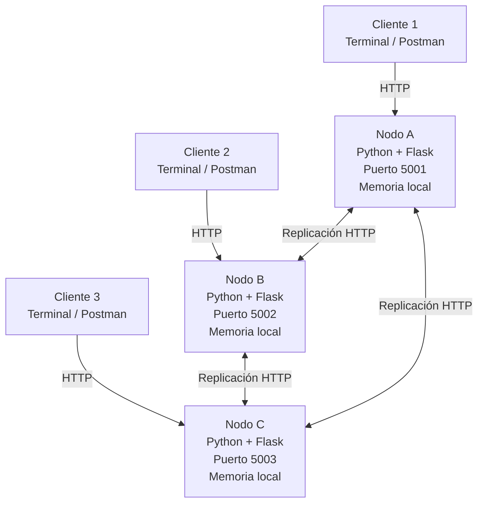
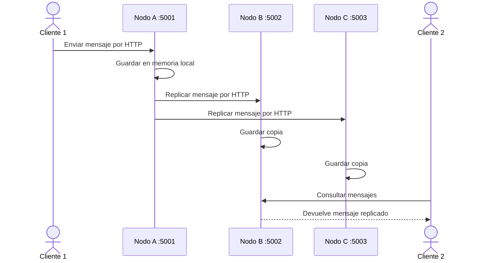
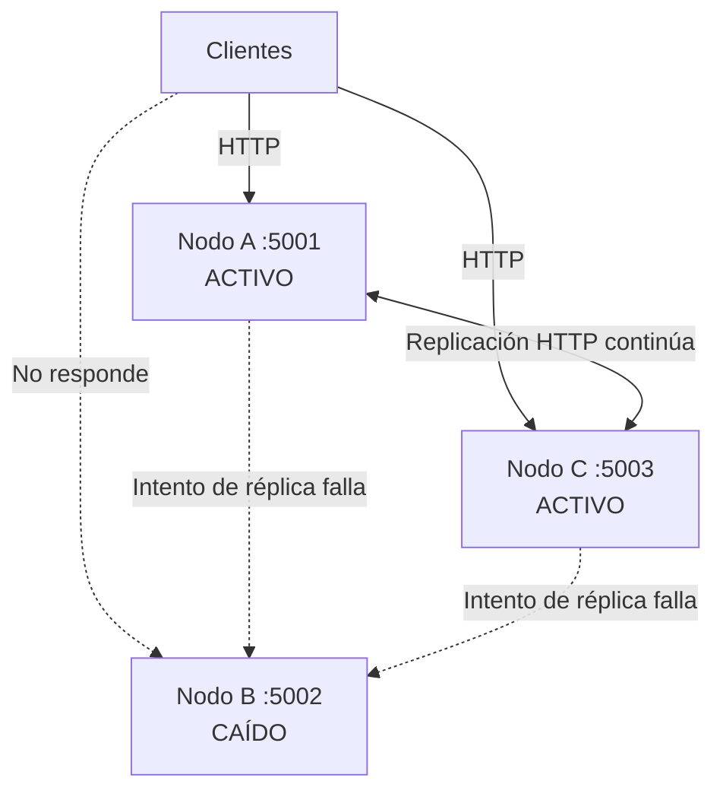

# NodeMesh

Sistema de chat distribuido. Varios nodos independientes que replican los mensajes entre sí: te conectas a cualquiera y el sistema sigue funcionando aunque tumbes uno.

Proyecto integrador de la Unidad I de **Sistemas Distribuidos**. No es un producto real; es una demo funcional para mostrar en código y en vivo los conceptos del curso: concurrencia, transparencia de acceso, tolerancia a fallos y escalabilidad horizontal.

## Qué demuestra

- **Procesos independientes por red.** Cada nodo es su propio proceso y se comunica por HTTP, nunca por memoria compartida.
- **Transparencia de acceso.** El cliente se conecta a cualquier nodo sin saber a cuál. Da igual.
- **Replicación.** Un mensaje que entra por el Nodo A aparece en el B y en el C.
- **Tolerancia a fallos.** Apagas un nodo y el chat sigue vivo con los que quedan.
- **Escalabilidad horizontal.** Agregar un nodo reparte la carga; el sistema no se reescribe para crecer.
- **Estilo arquitectónico:** cliente-servidor con replicación entre nodos (cada nodo es servidor para los clientes y par de los otros nodos).

## 1. Arquitectura general



**Idea clave:** cada nodo es un proceso independiente. Los clientes pueden conectarse a cualquiera y los nodos replican los mensajes por red, sin memoria compartida.

## 2. Flujo de mensajes



## 3. Tolerancia a fallos



**Comportamiento esperado:** si un nodo falla, ese proceso deja de atender peticiones, pero el chat continúa disponible mediante los nodos restantes. El proyecto no define todavía un mecanismo de resincronización automática para el nodo que vuelve a levantarse.

## Stack

| Herramienta | Para qué |
|---|---|
| Python 3 | Lenguaje de cada nodo y del cliente. |
| Flask | Framework de cada nodo. Ligero, levanta un servidor HTTP con pocas líneas. |
| requests | Para que un nodo llame a otro (replicación) y para el cliente de consola. |
| GitHub | Repo del equipo, control de versiones, entrega final. |
| Postman | Probar los endpoints a mano. |
| ngrok (free) | Exponer un nodo a internet para conectar máquinas en redes distintas. *(opcional)* |

El stack ya está decidido. Lo único innegociable: **cada nodo es un proceso independiente que se comunica por red.**

## Estructura del repo

```
Proyecto-Sistemas-Distribuidos/
├── node/
│   ├── app.py            # el nodo (mismo código para todas las instancias)
│   └── client.py         # cliente de consola para escribir y enviar mensajes
├── requirements.txt      # flask, requests
├── AGENTS.md             # reglas para asistentes de IA
├── CONTRIBUTING.md       # ramas, commits, flujo de trabajo
└── README.md             # incluye los diagramas de arquitectura (arriba)
```

## Endpoints del nodo

- `POST /mensajes` — lo usa un cliente. Guarda el mensaje (le pone `id` y `timestamp`) y lo replica a los peers.
- `POST /replicar` — lo usa otro nodo. Solo guarda, no reenvía (evita bucles).
- `GET /mensajes` — devuelve todos los mensajes guardados.
- `GET /salud` — estado del nodo, puerto, cuántos mensajes y sus peers.

## Cómo correrlo

Requisitos: Python 3.10+.

Instala las dependencias una sola vez:

```bash
pip install -r requirements.txt
```

**Un solo nodo:**

```bash
python node/app.py --puerto 5001
```

**Sistema distribuido (varios nodos).** Cada nodo en su propia terminal/máquina, con los otros como peers.

En una sola máquina, con puertos distintos:

```bash
# Terminal 1
python node/app.py --puerto 5001 --peers http://localhost:5002 http://localhost:5003
# Terminal 2
python node/app.py --puerto 5002 --peers http://localhost:5001 http://localhost:5003
# Terminal 3
python node/app.py --puerto 5003 --peers http://localhost:5001 http://localhost:5002
```

En máquinas distintas en la misma red, se usan las IPs locales (`ipconfig` para verlas):

```bash
# Máquina A
python node/app.py --puerto 5001 --peers http://IP_B:5001
# Máquina B
python node/app.py --puerto 5001 --peers http://IP_A:5001
```

En redes distintas, se usa ngrok (`ngrok http 5001` con el nodo ya arriba) y se ponen las URLs públicas en `--peers`.

> Nota Windows: la primera vez que levantes el nodo, si el firewall pregunta, dale **Permitir acceso** para que otras máquinas puedan conectarse a tu nodo.

## Cómo enviar y ver mensajes

**Con el cliente de consola** (escribes el mensaje a mano):

```bash
python node/client.py --nodo http://localhost:5001
```

Te pide tu usuario y luego escribes mensajes. Comandos: `ver` lista todos los mensajes del nodo, `salir` termina.

**Con Postman:**

- `POST http://localhost:5001/mensajes`, body raw/JSON: `{"usuario":"diego","texto":"hola"}`
- `GET http://localhost:5001/mensajes` para leer.

## Cómo probar que es distribuido

1. Levanta 2 nodos (dos máquinas, o dos terminales con puertos distintos), cada uno con el otro como peer.
2. Manda un mensaje al Nodo B (con el cliente o Postman).
3. Consulta el Nodo A (`GET /mensajes` o `ver` en el cliente).
4. El mensaje originado en B aparece en A. Eso es la replicación + transparencia de acceso.

## Cómo probar la tolerancia a fallos

Con varios nodos corriendo, apaga uno (Ctrl+C o cierra su terminal). Manda otro mensaje a un nodo vivo: sigue respondiendo y guardando. El nodo caído solo se pierde ese mensaje; el sistema no se cae.

## Estado por sesión

- **Sesión 1 — Diseño y arranque:** repo, README, convenciones y diagramas de arquitectura (arriba, en Mermaid). ✅
- **Sesión 2 — Un nodo funcionando:** `node/app.py` con endpoints de mensajes y salud. ✅
- **Sesión 3 — De un nodo a sistema distribuido:** replicación entre nodos (`--peers`, `/replicar`), cliente de consola, soporte ngrok. Código ✅. Falta la prueba en vivo entre máquinas y la captura del entregable.
- **Sesión 4 — Tolerancia a fallos y cierre:** el código ya tolera la caída de un nodo. Falta la demo en vivo y la presentación.

## Equipo

Equipo 1:

- Buenrostro Ávila Abdiel Gustavo
- Ramayo Aké Cynthia Silvana
- López Ramírez Diego Baudel
- Ramírez Rendón Naomi Elena
- Gómez González Víctor Andrés

## Cómo colaborar

Lee `CONTRIBUTING.md` antes de tu primer commit. Resumen: se trabaja sobre `develop`, nunca directo en `main`, y los commits siguen el formato `feat:`, `fix:`, `docs:`, etc.
