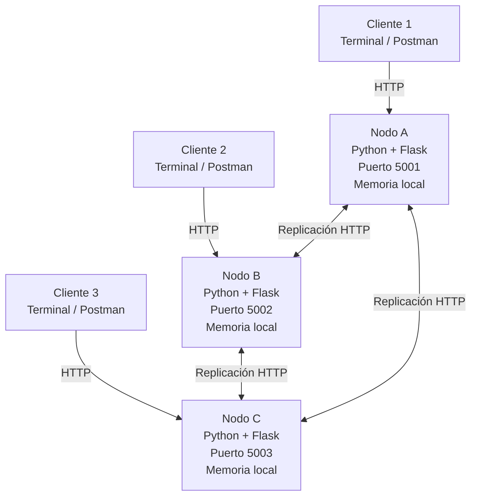
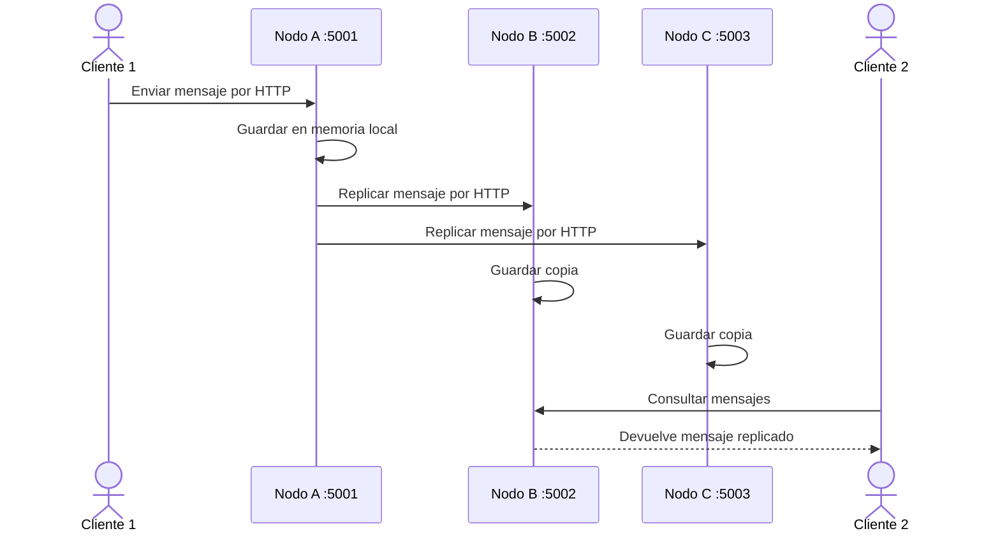
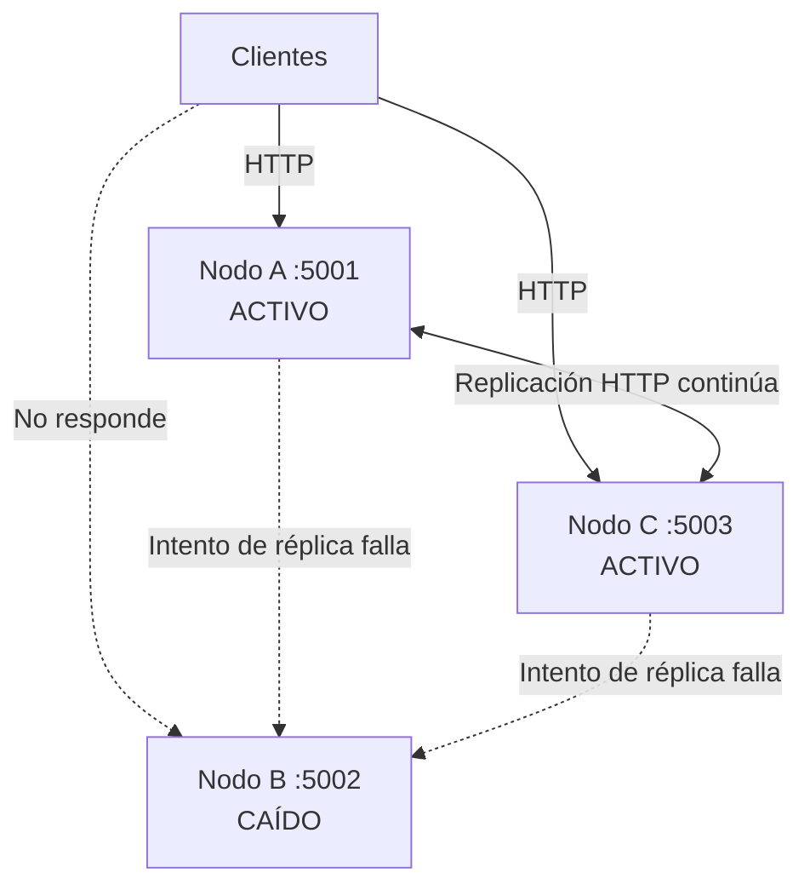

# NodeMesh

Sistema de chat distribuido. Varios nodos independientes que replican los mensajes entre sí: te conectas a cualquiera y el sistema sigue funcionando aunque tumbes uno.

Proyecto integrador de la Unidad I de **Sistemas Distribuidos**. No es un producto real; es una demo funcional para mostrar en código y en vivo los conceptos del curso: concurrencia, transparencia de acceso, tolerancia a fallos y escalabilidad horizontal.

## Qué demuestra

- **Procesos independientes por red.** Cada nodo es su propio proceso y se comunica por HTTP, nunca por memoria compartida.
- **Transparencia de acceso.** El cliente se conecta a cualquier nodo sin saber a cuál. Da igual.
- **Replicación.** Un mensaje que entra por el Nodo A aparece en el B y en el C.
- **Tolerancia a fallos.** Apagas un nodo y el chat sigue vivo con los que quedan.
- **Escalabilidad horizontal.** Agregar un nodo reparte la carga; el sistema no se reescribe para crecer.

## 1. Arquitectura general



**Idea clave:** cada nodo es un proceso independiente. Los clientes pueden conectarse a cualquiera y los nodos replican los mensajes por red, sin memoria compartida.

## 2. Flujo de mensajes



## 3. Tolerancia a fallos



**Comportamiento esperado:** si un nodo falla, ese proceso deja de atender peticiones, pero el chat continúa disponible mediante los nodos restantes. El proyecto no define todavía un mecanismo de resincronización automática para el nodo que vuelve a levantarse.


## Stack

| Herramienta | Para qué |
|---|---|
| Python 3 | Lenguaje de cada nodo. |
| Flask | Framework de cada nodo. Ligero, levanta un servidor HTTP con pocas líneas. |
| GitHub | Repo del equipo, control de versiones, entrega final. |
| Postman | Probar los endpoints antes de tener cliente. |
| ngrok (free) | Exponer un nodo a internet para simular distribución real. *(opcional)* |
| draw.io | Diagrama de arquitectura. |

El stack ya está decidido. No se cambia sin una razón puesta sobre la mesa. Lo único innegociable: **cada nodo es un proceso independiente que se comunica por red**.

## Estructura del repo

```
nodemesh/
├── node.py               # el nodo (mismo código para todas las instancias)
├── requirements.txt
├── docs/
│   └── arquitectura.drawio
├── AGENTS.md             # reglas para asistentes de IA
├── CONTRIBUTING.md       # ramas, commits, flujo de trabajo
└── README.md
```

## Cómo correrlo

Requisitos: Python 3.10+.

Instala las dependencias una sola vez:

```bash
pip install -r requirements.txt
```

**Un solo nodo (desarrollo):**

```bash
python node.py --port 5001
```

Prueba los endpoints desde Postman apuntando a `http://localhost:5001`.

**El sistema completo (2-3 nodos):**

Cada nodo va en su propia terminal, en un puerto distinto. Abre 2 o 3 terminales y corre:

```bash
# Terminal 1
python node.py --port 5001

# Terminal 2
python node.py --port 5002

# Terminal 3
python node.py --port 5003
```

Manda un mensaje a un nodo (por ejemplo al 5001) y consúltalo desde otro (el 5002) para verificar que la replicación funciona.

**Exponer un nodo a internet (opcional, con ngrok):**

```bash
ngrok http 5001
```

ngrok te da una URL pública para que otro equipo se conecte a tu nodo y simular distribución geográfica real.

**Probar tolerancia a fallos:**

Cierra la terminal de uno de los nodos (Ctrl+C). El chat sigue respondiendo en los nodos que quedan.

## Roadmap

El proyecto se construye en 4 sesiones. Cada una tiene un entregable concreto.

| Sesión | Objetivo | Entregable |
|---|---|---|
| 1 | Diseño y arranque | Diagrama de arquitectura + repo con README |
| 2 | Un nodo funcionando | Un nodo que recibe, guarda y entrega mensajes, probado |
| 3 | De un nodo a sistema distribuido | 2-3 nodos replicando mensajes entre sí |
| 4 | Tolerancia a fallos y cierre | Caída de un nodo en vivo + README final + demo |

## Equipo

Equipo 1:

- Buenrostro Ávila Abiel Gustavo
- Ramayo Aké Cynthia Silvana
- López Ramírez Diego Baudel
- Ramírez Rendón Naomi Elena
- Gómez González Víctor Andrés

## Cómo colaborar

Lee `CONTRIBUTING.md` antes de tu primer commit. Resumen: se trabaja sobre `develop`, nunca directo en `main`, y los commits siguen el formato `feat:`, `fix:`, `docs:`, etc.
